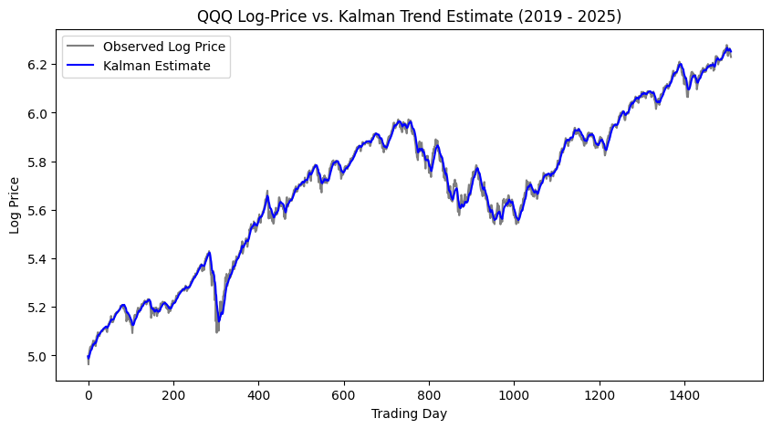
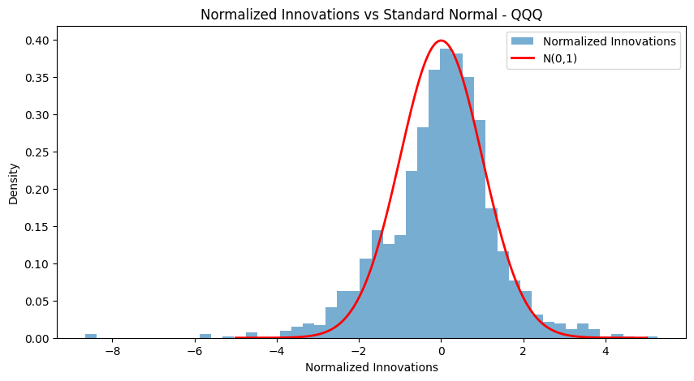
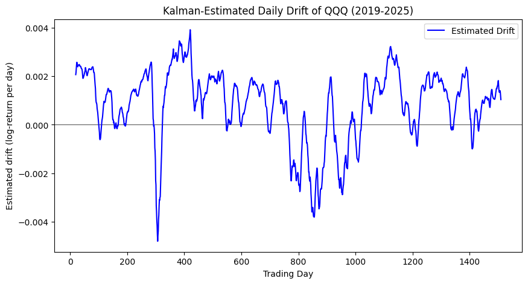
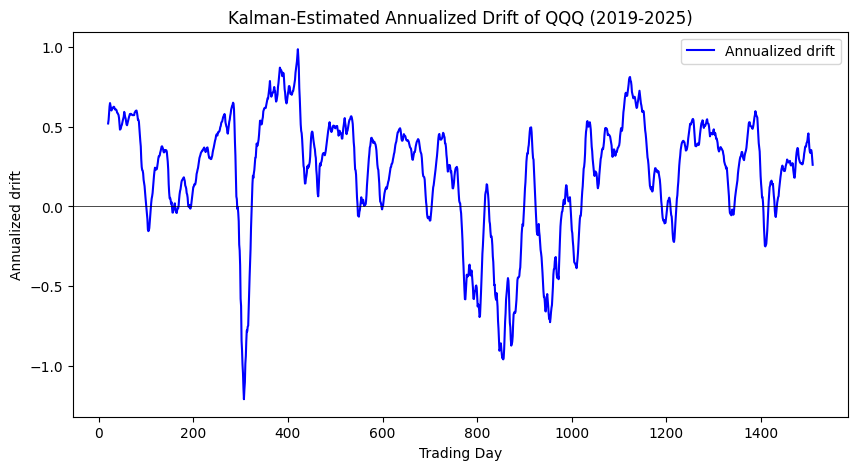

# Kalman Filter Trend Estimation

# Introduction
A constant-velocity Kalman filter, implemented from scratch in NumPy, that estimates the underlying trend and drift of equity index ETFs from noisy price data. Uses innovation-whiteness testing for validation, with an honest evaluation of the model's limitations.

# The Problem
The Kalman filter, developed by Rudolf Kálmán in 1960, was built to estimate a hidden state from noisy measurements. The same problem that guided Apollo's navigation is applied here to the markets. At each step, it blends a prediction from its motion model with the incoming measurement, weighting the two by their relative uncertainty: noisy measurements make it lean towards its prediction; an uncertain prediction makes it lean toward the data. Its central assumption is Gaussian noise, which holds for spacecraft's sensors but is known to break for equity returns. This project extracts the underlying trend of the Nasdaq-100 from noisy prices and examines what broken assumptions cost.

![QQQ daily close price, 2019-2025]

# Build

### Scalar Filter & the Tail-Risk Lesson
A one-dimensional filter recovering a constant signal from Gaussian noise. It worked cleanly. To stress-test it under market-like conditions, I replaced the noise with a fat-tailed Student's t distribution (df=3) and found that the RMSE barely changed (from 0.45 to 0.44), while the maximum error spiked on outlier days. Learned how average-case error metrics are blind to tail risk, which is precisely the one that matters in markets.

### Tracking a trend by adding velocity
I tested the same filter on a trending signal rather than a constant one, and the estimate persistently lagged. The cause was structural: the filter had no concept of motion, so its prediction would always be stagnant and not adapt quickly enough. By adding velocity to the state (a constant-velocity model), the lag was eliminated. More astonishingly, the filter now recovered the velocity itself, a quantity it never directly measured, inferred purely from how the position estimate kept getting surprised.

### Application to Real Market Data (QQQ)
Moving to real price data removed the ground truth entirely: unlike earlier synthetic stages, there is no "true" value to check against; the fair price is unobservable, which is the central issue of applying the Kalman filter to markets. The key modeling decision was to filter log-prices rather than raw price data. The constant-velocity model assumes linear, additive motion, but raw price compounds, growing multiplicatively. Taking the log converts that multiplicative growth into additive steps, so an exponential price path becomes a straight line. These exact dynamics are what the model was built for. In addition, velocity then began to represent the daily log-return, a percentage that is comparable across time and price levels.

### Estimating R from Data
Rather than guessing the measurement-noise variance, I estimated it directly from the data. I used the variance of the daily log-returns, which sets R to the actual scale of daily price fluctuation. One tradeoff from this step was the computation over the full sample, introducing a mild look-ahead bias. A production implementation would use a rolling window, estimating R from only previous data at each step.

### Validation via innovation whiteness test
With no true fair value, I couldn't check the accuracy of estimates; instead, I checked the filter's mistakes. At each step, the filter produces an innovation (y), which represents how far its prediction missed the measurement. Its predicted variance (S) was also calculated, showing how large a miss is expected at each step. If the model was correctly extracting all the structure in the data, the leftover innovations should be pure noise. The normalized innovations (y/√S) should be standard normal and uncorrelated ("white"). I tested two properties: the standard deviation, which should approach 1, meaning that the filter's uncertainty is calibrated; I also tested for the lag-1 autocorrelation, which should approach 0, meaning that no predictable pattern remains. Nonzero autocorrelation would mean the filter is leaving unused structure behind, becoming evidence of model misspecification.

### The Tuning sweep and the misspecification finding
To tune the process-noise Q, rather than guessing, I ran a grid search over 12 settings, measuring the innovation std and autocorrelation for each. The result showed me a systematic flaw: no setting satisfied both criteria simultaneously. Settings that calibrated the filter (std≈1) left substantial autocorrelation(~0.6), while settings that whitened the innovations drove the filter underconfident (std<0.8). This is not a tuning failure; it is systematic evidence that the constant-velocity Gaussian model is misspecified for equity returns. No choice of Q can fix a structural problem; the residual autocorrelation reflects momentum and volatility clustering that the model cannot represent. I selected Q to be (1e-5,1e-8), which, despite not being the best setting, produced the most readable drift signal. Its main purpose being regime detection, I then had the trade-off of having  a residual correlation of 0.74, which I would rather disclose than hide. For future work, I plan on replacing the fixed noise covariances with an adaptive Q/R or a regime-switching model to better capture the changing volatility regimes.

# Limitations

**Gaussian Noise assumption:**
The Kalman filter is provably optimal only when the noise is Gaussian, but equity returns are fat-tailed, being better modeled by a low degree of freedom Student's t (df≈3-5), which permits far more extreme moves than a Gaussian. On real data, this means the filter is no longer the optimal estimator and can be dragged by outliers on highly volatile days, exactly as the fat tails in the innovation histogram confirm.

**Model misspecification:**
No single Q simultaneously whitens the innovations and calibrates the filter. Settings that bring the standard deviation toward 1 leave substantial autocorrelations, and settings that reduce autocorrelation leave the filter underconfident. This is a structural problem, not a tuning failure. A constant-velocity Gaussian model can't represent the momentum and volatility clustering present in equity returns, so some of the structure will always remain residual.

**Look-ahead bias in R:**
The measurement-noise variance R was estimated as the variance of daily log-returns over the entire sample. Since the filter at each step effectively "sees" a noise estimate derived from future data, it introduces a mild look-ahead bias. A production implementation would use a rolling or expanding window, estimating R from only past data at each step.

**Linear trend assumptions:**
The constant-velocity model assumes the underlying trend persists smoothly, but real market trends shift abruptly. A single event can reverse direction entirely. Since the model's structure assumes the previous drift continues, it can only respond to such reversals with lag.

# Execution

### How to Run
The project runs top-to-bottom in Google Colab or Jupyter, no local setup required beyond installing the data library:

!pip install yfinance

### Dependencies
NumPy(filter equations and mathematics), Matplotlib(plots),yfinance(price data).
To run the filter on a different ETF or period, change the ticker and date range in the driver:

log_prices = load_log_prices("QQQ", "2019-01-01", "2025-01-01")

The process-noise parameters q_pos and q_vel in the Kalman function call control the smoothness vs responsiveness tradeoff; Sweep Q grid-searches them against the innovation diagnostics test.
